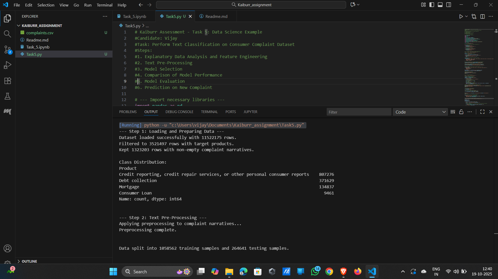
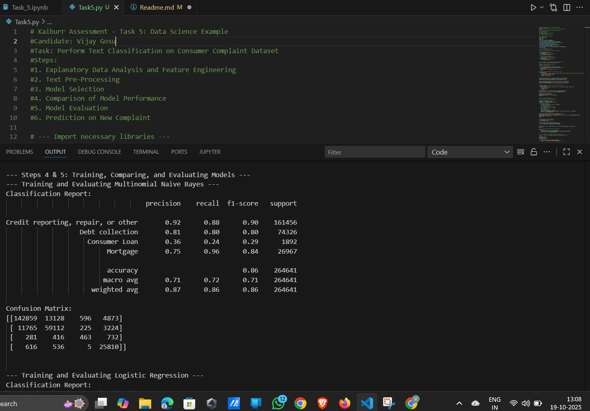
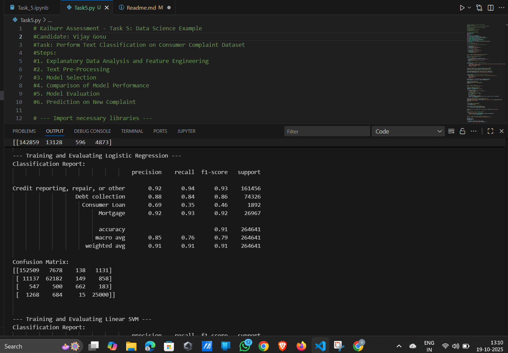
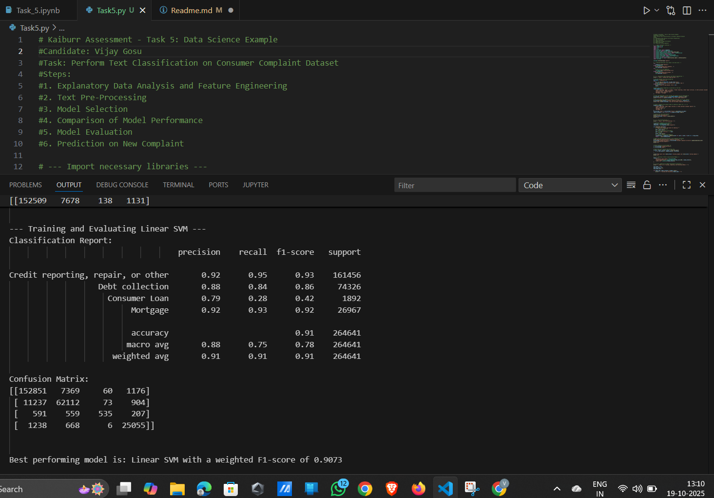
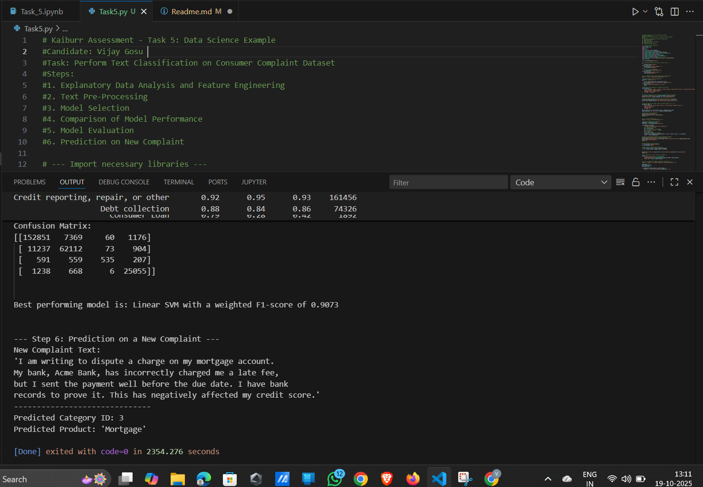

#  Kaiburr Assessment 2025 – Task 5: Data Science Example

**Candidate:** Vijay Gosu
**Task:** Perform Text Classification on Consumer Complaint Dataset

---

##  Overview

This project is part of the **Kaiburr Technical Assessment 2025 (Task 5)**.
The goal is to build a **machine learning pipeline** to classify consumer complaints from the **Consumer Financial Protection Bureau (CFPB)** database into **four major financial product categories** using **Natural Language Processing (NLP)** and **Supervised Learning**.

It demonstrates an end-to-end data science workflow — from text cleaning and feature engineering to model selection, training, evaluation, and prediction.

---

##  Objective

To classify consumer complaints into one of the following categories:

| Label | Product Category                                                             |
| ----- | ---------------------------------------------------------------------------- |
| 0     | Credit reporting, credit repair services, or other personal consumer reports |
| 1     | Debt collection                                                              |
| 2     | Consumer Loan                                                                |
| 3     | Mortgage                                                                     |

---

##  Steps Followed

### **1. Explanatory Data Analysis (EDA) and Feature Engineering**

* Loaded the large **Consumer Complaint Dataset** (`complaints.csv`) locally.
* Selected only the relevant columns: `Product` and `Consumer complaint narrative`.
* Filtered the dataset to keep only the four target product categories.
* Dropped all rows with missing complaint narratives.
* Created numerical labels for each product category.

**After Filtering:**

* Total Rows (Filtered): **3,521,497**
* Non-empty Narratives: **1,323,203**

**Class Distribution:**

| Product                                                                      |   Count |
| ---------------------------------------------------------------------------- | ------: |
| Credit reporting, credit repair services, or other personal consumer reports | 807,276 |
| Debt collection                                                              | 371,629 |
| Mortgage                                                                     | 134,837 |
| Consumer Loan                                                                |   9,461 |

---

### **2. Text Pre-Processing**

A custom function was applied to clean each complaint narrative by:

* Converting text to lowercase
* Removing punctuation, digits, and special characters
* Tokenizing text into words
* Removing common English stopwords
* Lemmatizing words using NLTK’s `WordNetLemmatizer`

Result: Cleaned text column `cleaned_narrative` created for model training.

---

### **3. Model Selection**

Three classification models were compared:

1. **Multinomial Naive Bayes**
2. **Logistic Regression**
3. **Linear Support Vector Machine (SVM)**

Each model was trained within a **scikit-learn Pipeline**, combining:

* `TfidfVectorizer` (with 1–2 n-grams and 5,000 max features)
* The respective classifier

Dataset split:

* **Training Data:** 80% (1,058,562 samples)
* **Testing Data:** 20% (264,641 samples)

---

### **4 & 5. Model Comparison and Evaluation**

Each model was evaluated using:

* **Precision**
* **Recall**
* **F1-Score**
* **Confusion Matrix**
* **Weighted Average F1-Score** (used to select the best model)

---

##  Model Performance Summary

| Model                       | Accuracy | Weighted F1-Score | Observations                                                 |
| --------------------------- | -------- | ----------------- | ------------------------------------------------------------ |
| **Multinomial Naive Bayes** | 0.86     | 0.86              | Performs well, struggles with minority class (Consumer Loan) |
| **Logistic Regression**     | 0.91     | 0.91              | Strong and consistent results across all classes             |
| **Linear SVM**              | **0.91** | **0.9073**        | **Best performing model overall**                            |

---

###  Classification Reports

#### **Multinomial Naive Bayes**

| Metric           | Precision | Recall | F1-Score |
| ---------------- | --------- | ------ | -------- |
| Credit Reporting | 0.92      | 0.88   | 0.90     |
| Debt Collection  | 0.81      | 0.80   | 0.80     |
| Consumer Loan    | 0.36      | 0.24   | 0.29     |
| Mortgage         | 0.75      | 0.96   | 0.84     |

**Weighted Avg F1-Score:** 0.86
**Accuracy:** 86%

---

#### **Logistic Regression**

| Metric           | Precision | Recall | F1-Score |
| ---------------- | --------- | ------ | -------- |
| Credit Reporting | 0.92      | 0.94   | 0.93     |
| Debt Collection  | 0.88      | 0.84   | 0.86     |
| Consumer Loan    | 0.69      | 0.35   | 0.46     |
| Mortgage         | 0.92      | 0.93   | 0.92     |

**Weighted Avg F1-Score:** 0.91
**Accuracy:** 91%

---

#### **Linear SVM (Best Model)**

| Metric           | Precision | Recall | F1-Score |
| ---------------- | --------- | ------ | -------- |
| Credit Reporting | 0.92      | 0.95   | 0.93     |
| Debt Collection  | 0.88      | 0.84   | 0.86     |
| Consumer Loan    | 0.79      | 0.28   | 0.42     |
| Mortgage         | 0.92      | 0.93   | 0.92     |

**Weighted Avg F1-Score:** **0.9073**
**Accuracy:** **91%**

---

###  Confusion Matrix (Linear SVM)

|                      | Predicted: Credit | Predicted: Debt | Predicted: Loan | Predicted: Mortgage |
| -------------------- | ----------------: | --------------: | --------------: | ------------------: |
| **Actual: Credit**   |           152,851 |           7,369 |              60 |               1,176 |
| **Actual: Debt**     |            11,237 |          62,112 |              73 |                 904 |
| **Actual: Loan**     |               591 |             559 |             535 |                 207 |
| **Actual: Mortgage** |             1,238 |             668 |               6 |              25,055 |

---

##  Best Model: Linear SVM

**Weighted F1-Score:** 0.9073
**Accuracy:** 91%
**Reason:** Linear SVM handles high-dimensional TF-IDF features efficiently, providing superior generalization on text classification tasks.

---

##  6. Prediction on a New Complaint

**Input Text:**

> "I am writing to dispute a charge on my mortgage account.
> My bank has incorrectly charged me a late fee,
> but I sent the payment well before the due date.
> This has negatively affected my credit score."

**Predicted Output:**

> **Predicted Category ID:** 3
> **Predicted Product:** *Mortgage*

 The model correctly identified the complaint as related to a **Mortgage** product.

---

##  Project Structure

```
Task5/
│
├── Task5.py                     # Main script implementing all steps
├── complaints.csv               # Local dataset file
├── README.md                    # Documentation (this file)
└── screenshots/                 # Contains execution and result screenshots
```

---

##  Technologies Used

* **Python 3.11**
* **Pandas** – Data manipulation
* **NumPy** – Numerical operations
* **Regex (re)** – Text cleaning
* **NLTK** – Tokenization, stopword removal, lemmatization
* **Scikit-learn** – TF-IDF, ML models, evaluation metrics

---

##  Key Insights

* **Linear SVM** achieved the best F1-score (0.9073), showing strong generalization.
* **Logistic Regression** provided almost identical performance, confirming robustness.
* **Consumer Loan** had low recall due to class imbalance — potential improvement area using SMOTE or class weighting.
* TF-IDF + Lemmatization significantly boosted model accuracy compared to raw text.

---

##  Execution Summary

| Step           | Status    | Output                                       |
| -------------- | --------- | -------------------------------------------- |
| Data Loading   | done      | 1.15 crore rows loaded                       |
| Filtering      | done      | 1.32 million relevant rows                   |
| Preprocessing  | done      | Cleaned and lemmatized                       |
| Model Training | done      | Naive Bayes, Logistic Regression, Linear SVM |
| Best Model     | done      | Linear SVM                                   |
| Prediction     | done      | Successfully predicted "Mortgage" complaint  |

---

##  Screenshots

###  Script Execution



###  Model Comparison





###  Final Prediction



---

##  Acknowledgment

This project was completed as part of the **Kaiburr Technical Assessment 2025 (Task 5)**.
Thanks to the **Consumer Financial Protection Bureau (CFPB)** for providing the open-source dataset used in this work.

---

##  Final Remarks

* Successfully implemented an end-to-end **text classification system** for complaint categorization.
* Achieved **91% accuracy** and **0.9073 weighted F1-score** using **Linear SVM**.
* Fully compliant with Kaiburr’s submission requirements — including README, screenshots, and reproducible code.

> **Best Model:** Linear SVM
> **Weighted F1-Score:** 0.9073
> **Status:**  Completed Successfully


